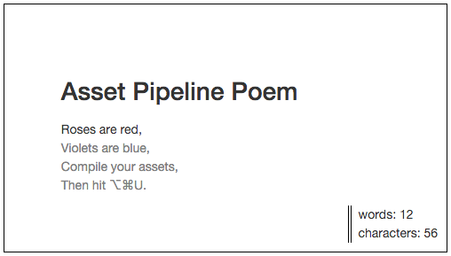

#  Asset Pipeline Poem

**Objective:** Practice requiring CSS and JavaScript files in the Rails asset pipeline and precompiling assets.

**Terms:**

* Manifest
* Precompilation
* Concatenation
* Compression / Minification
* Browser Caching
* MD5 fingerprint

## Ode to the Asset Pipeline

Your goal is to reconstruct a simple poem. To get started:

* Clone this repo, and take any steps necessary to get the app running on your computer.
  * Note that this Rails app doesn't have a database.
* Start your server, and navigate to `localhost:3000` in the browser. You should see a jumbled poem.

The poem should eventually look like this when you're done making changes:



#### Rules

* You are not allowed to modify any files *except* `app/assets/javascripts/application.js`, `app/assets/stylesheets/application.css`, and `config/environments/development.rb` (to configure asset precompilation).
* Try not to use `require_tree .` anywhere.

#### Using the Asset Pipeline

The assets you need to require will live somewhere in the following locations, inside of your Rails application directory:

```
app/                   # application specific code
  assets/
    images/
    javascripts/
    stylesheets/
lib/                   # custom libraries
  assets/
    javascripts/
    stylesheets/
vendor/                # third party libraries
  assets/
    javascripts/
    stylesheets/
```

Each directory has a specific use case. The files you want are scattered across them. **Your goal is to find all the files and require them in the correct order!**

A solution is in the [solution branch](https://github.com/sf-wdi-30/asset_pipeline_poem/tree/solution).

## Bonus: Using Third-Party Code

1. Note that the Bootstrap CSS and JavaScript libraries are included in `views/layouts/application.html.erb` using CDN links. Practice requiring the files through the asset pipeline instead:

  * Find and copy the current `bootstrap.css` URL (see `views/layouts/application.html.erb`).
  * From the Terminal, run `curl -vs BOOTSTRAP_CSS_URL_YOU_COPIED > vendor/assets/stylesheets/bootstrap.min.css`.  Many developers use Bower to manage packages instead of manually `curl`ing and `>` in files into the correct directory, but try this way for now.
  * Finally, delete the CDN link from `application.html.erb`, and `require` the new Bootstrap CSS file in your `application.css` manifest.
  * Repeat these steps for the Bootstrap JavaScript library.
  * Precompile your assets.

    > Note: we're more likely to precompile assets in development, to check that assets are set up correctly for production. Many production environments (including Heroku) will precompile for us!


2. Downloading the Bootstrap CSS and JavaScript files through `curl` or Bower isn't the only option to use Bootstrap with the Rails asset pipeline! You can also use the <a href="https://github.com/twbs/bootstrap-sass">bootstrap-sass gem</a>.  
  * In `application.css` and `application.js`, remove the `require` statements for Bootstrap, and use the bootstrap-sass gem instead (follow the <a href="https://github.com/twbs/bootstrap-sass#a-ruby-on-rails" >installation steps</a> in the docs).
  * After installing bootstrap-sass, precompile your assets again.


 > It's often easier to use a well-documented gem than to to work directly with the asset pipeline. Watch out for gems that haven't been updated in a while, though, or for bad interactions among gems.

 A solution for this bonus is in the [solution_bootstrap_sass branch](https://github.com/sf-wdi-30/asset_pipeline_poem/tree/solution_bootstrap_sass).
